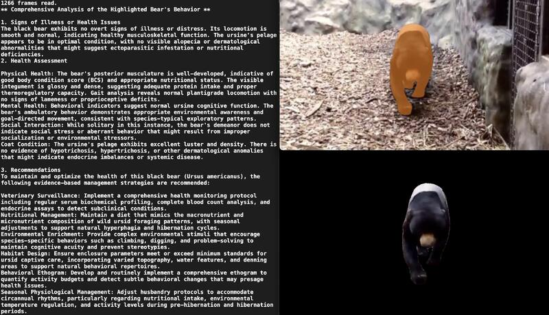

## What & Why
**What**: AnimalCare is an open-source project that leverages AI-driven insights for advanced animal behavior monitoring and welfare analysis.  
**Why**: By providing tools to analyze video input and deliver actionable insights, AnimalCare empowers veterinarians, researchers, and animal caregivers to make informed decisions that enhance animal health and welfare.

<p align="center">
  
</p>


---

<p align="center">
    
</p>
<p align="center"><h1 align="center">ANIMALCARE</h1></p>
<p align="center">
	<em>Empowering Insights, Enhancing Animal Welfare</em>
</p>
<p align="center">
	
	
	
	
</p>
<p align="center"><!-- default option, no dependency badges. -->
</p>
<p align="center">
	<!-- default option, no dependency badges. -->
</p>
<br>

## 🔗 Table of Contents
 
- [📍 Overview](#-overview)
- [👾 Features](#-features)
- [📁 Project Structure](#-project-structure)
  - [📂 Project Index](#-project-index)
- [🚀 Getting Started](#-getting-started)
  - [☑️ Prerequisites](#-prerequisites)
  - [⚙️ Installation](#-installation)
  - [🤖 Usage](#🤖-usage)
  - [🧪 Testing](#🧪-testing)
- [📌 Project Roadmap](#-project-roadmap)
- [🔰 Contributing](#-contributing)
- [🎗 License](#-license)
- [🙌 Acknowledgments](#-acknowledgments)

---

## 📍 Overview

AnimalCare is an innovative open-source project designed to enhance animal welfare through advanced video analysis and AI-driven insights. By processing video inputs to monitor and assess animal behavior, the project aids veterinarians, researchers, and animal behaviorists in making informed health and welfare decisions. Key features include object segmentation, behavior analysis, and health assessment tools, making AnimalCare essential for professionals dedicated to improving animal care practices.

---

## 👾 Features

|      | Feature         | Summary       |
| :--- | :---:           | :---          |
| ⚙️  | **Architecture**  | <ul><li>Utilizes Jupyter notebooks (`sam2_final.ipynb`) for data processing and analysis.</li><li>Python scripts like `main1.py` and `BehaviorAnalysis/gptCall.py` handle specific functionalities such as video processing and AI-driven analysis.</li><li>Relies on a structured `requirements.txt` for managing dependencies, ensuring consistent environments across development and production.</li></ul> |
| 🔩 | **Code Quality**  | <ul><li>Code is modularized into scripts and notebooks for specific tasks.</li><li>Uses Python extensively, evident from `.py` files and Jupyter notebooks.</li><li>Adheres to dependency management practices with multiple `requirements.txt` files.</li></ul> |
| 📄 | **Documentation** | <ul><li>Documentation includes installation and usage commands, facilitating easy setup and operation.</li><li>Primary languages for documentation are Python and Markdown, with interactive notebooks also serving as documentation and demonstration tools.</li><li>Documentation spread across various file types (`ipynb`, `txt`, `py`), indicating a comprehensive approach.</li></ul> |
| 🔌 | **Integrations**  | <ul><li>Integrates with AI services like OpenAI for enhanced data analysis (`BehaviorAnalysis/gptCall.py`).</li><li>Employs various Python libraries (`numpy`, `pandas`, `matplotlib`) for data handling and visualization.</li><li>Uses `opencv-python` for image processing tasks within the `BehaviorAnalysis` module.</li></ul> |
| 🧩 | **Modularity**    | <ul><li>Project structure includes separate modules for behavior analysis and main application logic.</li><li>Scripts like `main1.py` and `BehaviorAnalysis/gptCall.py` indicate a clear separation of concerns.</li><li>Reusable components such as Jupyter notebooks for iterative testing and presentation.</li></ul> |
| 🧪 | **Testing**       | <ul><li>Testing procedures are outlined but specific details or frameworks are not mentioned in the provided data.</li><li>Usage of interactive notebooks may also support live testing and debugging.</li><li>Dependency on consistent environments suggests a focus on integration testing.</li></ul> |
| ⚡️  | **Performance**   | <ul><li>Uses asynchronous libraries like `aiohttp` and `aiosignal` to enhance performance.</li><li>Performance considerations are evident in the handling of video and image data.</li><li>Efficient data processing with Python's scientific stack (`numpy`, `scipy`).</li></ul> |
| 🛡️ | **Security**      | <ul><li>Dependency management through `requirements.txt` helps mitigate risks associated with library vulnerabilities.</li><li>Use of secure API calls in `BehaviorAnalysis/gptCall.py` for interacting with external AI services.</li><li>Uses security practices like verification in the provided files.</li></ul> |

---

## 📁 Project Structure

```sh
└── AnimalCare/
    ├── BehaviorAnalysis
    │   ├── demo1.mp4
    │   ├── final_segmented_video
    │   ├── gptCall.py
    │   └── requirements.txt
    ├── README.md
    ├── main1.py
    ├── requirements.txt
    └── sam2_final.ipynb
```


### 📂 Project Index
<details open>
	<summary><b><code>ANIMALCARE/</code></b></summary>
	<details> <!-- __root__ Submodule -->
		<summary><b>__root__</b></summary>
		<blockquote>
			<table>
			<tr>
				<td><b><a href='https://github.com/sandeepsalwan1/AnimalCare/blob/master/sam2_final.ipynb'>sam2_final.ipynb</a></b></td>
				<td>- The file `sam2_final.ipynb` serves as a Jupyter notebook within the project, likely functioning as a final or consolidated version of analysis or computation designated by the "final" in its name<br>- This notebook is integral to the project's data processing or analysis phase, providing a platform for executing Python code in an interactive environment which is beneficial for iterative testing, data visualization, or presenting statistical findings.

Given its placement and naming convention, `sam2_final.ipynb` is possibly a culmination of previous work or experiments documented in other notebooks or scripts within the project<br>- It might contain finalized scripts, key insights, or results that are critical for the project's objectives<br>- This could include data manipulation, visualization, model training, or result interpretation tasks that are essential for the project's subsequent stages or for delivering the project's end goals.

The notebook's role in the broader architecture is likely central to the analytical or processing component of the project, interfacing with data inputs and generating outputs that could be used by other parts of the project for further development or reporting.</td>
			</tr>
			<tr>
				<td><b><a href='https://github.com/sandeepsalwan1/AnimalCare/blob/master/requirements.txt'>requirements.txt</a></b></td>
				<td>- The `requirements.txt` file serves a crucial role in the architecture of the entire codebase by specifying the exact versions of external libraries and packages that the project depends on<br>- This file ensures that the development, testing, and production environments are consistent, preventing discrepancies that could arise from version mismatches<br>- It lists various Python libraries such as `aiohttp`, `aiosignal`, and `anyio`, among others, which are essential for the project's asynchronous operations and other functionalities<br>- By locking down specific versions, the file aids in maintaining the stability and compatibility of the application across different setups and deployments<br>- This approach minimizes potential conflicts and aids in the smooth operation and maintenance of the software system as a whole.</td>
			</tr>
			<tr>
				<td><b><a href='https://github.com/sandeepsalwan1/AnimalCare/blob/master/main1.py'>main1.py</a></b></td>
				<td>- Processes video input to extract frames, applies a deep learning model for object segmentation, and refines segmentation based on user-defined points<br>- Outputs include visualized segmentation masks and a final video compilation, showcasing the segmented objects across frames for both analysis and presentation purposes.</td>
			</tr>
			</table>
		</blockquote>
	</details>
	<details> <!-- BehaviorAnalysis Submodule -->
		<summary><b>BehaviorAnalysis</b></summary>
		<blockquote>
			<table>
			<tr>
				<td><b><a href='https://github.com/sandeepsalwan1/AnimalCare/blob/master/BehaviorAnalysis/gptCall.py'>gptCall.py</a></b></td>
				<td>- BehaviorAnalysis/gptCall.py processes video input to extract frames, encode them in base64, and utilizes an OpenAI client to generate comprehensive animal behavior analyses based on selected video frames<br>- The script aims to assist animal behaviorists by providing detailed observations and health assessments from visual data.</td>
			</tr>
			<tr>
				<td><b><a href='https://github.com/sandeepsalwan1/AnimalCare/blob/master/BehaviorAnalysis/requirements.txt'>requirements.txt</a></b></td>
				<td>- Serves as the dependency manifest for the BehaviorAnalysis module, specifying essential libraries such as opencv-python for image processing and openai for leveraging AI capabilities<br>- These dependencies are crucial for the module's functionality, which likely involves image analysis and AI-driven data interpretation within the broader project architecture.</td>
			</tr>
			</table>
		</blockquote>
	</details>
</details>

---
## 🚀 Getting Started

### ☑️ Prerequisites

Before getting started with AnimalCare, ensure your runtime environment meets the following requirements:

- **Programming Language:** Error detecting primary_language: {'ipynb': 1, 'txt': 2, 'py': 2}
- **Package Manager:** Pip


### ⚙️ Installation

Install AnimalCare using one of the following methods:

**Build from source:**

1. Clone the AnimalCare repository:
```sh
❯ git clone https://github.com/sandeepsalwan1/AnimalCare
```

2. Navigate to the project directory:
```sh
❯ cd AnimalCare
```

3. Install the project dependencies:


**Using `pip`** &nbsp; []()

```sh
❯ echo 'INSERT-INSTALL-COMMAND-HERE'
```


### 🤖 Usage
Run AnimalCare using the following command:
**Using `pip`** &nbsp; []()

```sh
❯ echo 'INSERT-RUN-COMMAND-HERE'
```


### 🧪 Testing
Run the test suite using the following command:
**Using `pip`** &nbsp; []()

```sh
❯ echo 'INSERT-TEST-COMMAND-HERE'
```


---
## 📌 Project Roadmap

- [X] **`Task 1`**: <strike>Complete front+backend.</strike>
- [ ] **`Task 2`**: Enhance chatbot.
- [ ] **`Task 3`**: Expand frontend.

---

## 🔰 Contributing

- **💬 [Join the Discussions](https://github.com/sandeepsalwan1/AnimalCare/discussions)**: Share your insights, provide feedback, or ask questions.
- **🐛 [Report Issues](https://github.com/sandeepsalwan1/AnimalCare/issues)**: Submit bugs found or log feature requests for the `AnimalCare` project.
- **💡 [Submit Pull Requests](https://github.com/sandeepsalwan1/AnimalCare/blob/main/CONTRIBUTING.md)**: Review open PRs, and submit your own PRs.

<details closed>
<summary>Contributing Guidelines</summary>

1. **Fork the Repository**: Start by forking the project repository to your github account.
2. **Clone Locally**: Clone the forked repository to your local machine using a git client.
   ```sh
   git clone https://github.com/sandeepsalwan1/AnimalCare
   ```
3. **Create a New Branch**: Always work on a new branch, giving it a descriptive name.
   ```sh
   git checkout -b new-feature-x
   ```
4. **Make Your Changes**: Develop and test your changes locally.
5. **Commit Your Changes**: Commit with a clear message describing your updates.
   ```sh
   git commit -m 'Implemented new feature x.'
   ```
6. **Push to github**: Push the changes to your forked repository.
   ```sh
   git push origin new-feature-x
   ```
7. **Submit a Pull Request**: Create a PR against the original project repository. Clearly describe the changes and their motivations.
8. **Review**: Once your PR is reviewed and approved, it will be merged into the main branch. Congratulations on your contribution!
</details>

<details closed>
<summary>Contributor Graph</summary>
<br>
<p align="left">
   <a href="https://github.com{/sandeepsalwan1/AnimalCare/}graphs/contributors">
      
   </a>
</p>
</details>

---

## 🎗 License

AnimalCare is released under the [MIT License](https://opensource.org/licenses/MIT/). For more details, please refer to the [LICENSE](./LICENSE) file.


---
